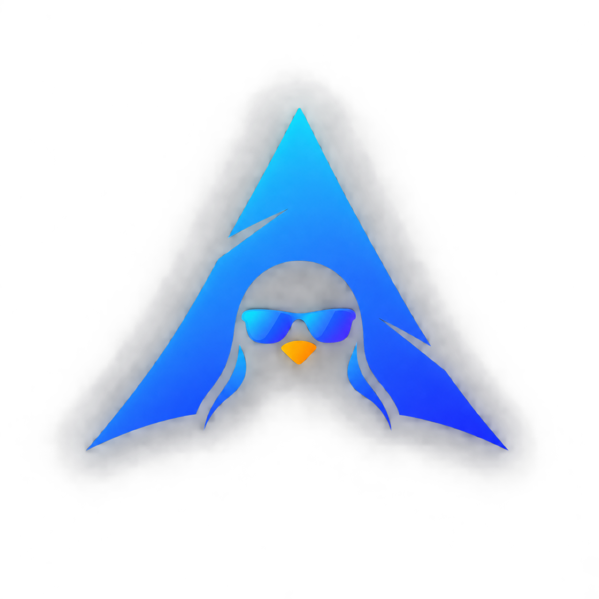

<p align="center">
  
</p>

<h1 align="center">Larch</h1>

<p align="center">Arch based linux distro for lazy yet power users.</p>

<p align="center"><a href="https://larchos.vercel.app">larchos.vercel.app</a></p>

niri and noctalia by default, stock Arch repos underneath. Full docs, including the desktop guide, build instructions, and the project roadmap, live at [larchos.vercel.app](https://larchos.vercel.app).

## Showcase


## Quick build

```sh
git clone --recurse-submodules git@github.com:larch-os/larch-base.git
cd larch-base
make prepare
make iso
```

See [Building the ISO](https://larchos.vercel.app/docs/development/building-the-iso) for what `make prepare` actually does, and a real gotcha around incremental rebuilds.

## Repo layout

```
archiso/releng/   archiso profile for the ISO, forked from the official releng profile
scripts/          pre-ISO prep tooling (AUR packages, wallpapers, submodules)
Makefile          prepare/iso/clean targets wrapping scripts/ and mkarchiso
assets/           brand assets (logo, splash source)
docs/             design notes
```
